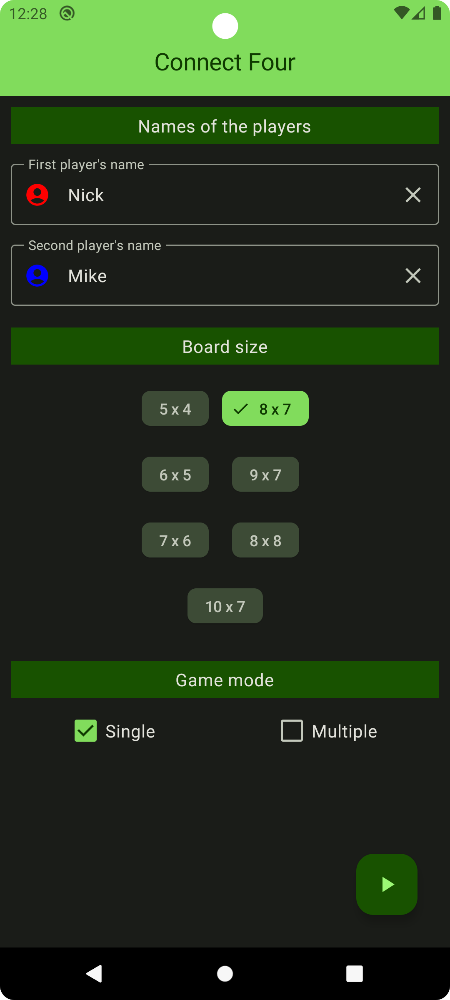

# Connect Four

  
Table of Contents

  <ol>
    <li>
        <a href="#about-the-app">About the app</a>
    </li>
    <li>
        <a href="#about-the-game">About the game</a>
    </li>
    <li>
        <a href="#links">Links</a>
    </li>
  </ol>

## About the app

Select the board size and game mode and start the game.

## About the game

The Connect Four game is a classic strategy game in which 2 players go head-to-head in a battle
to own the grid!

You drop the discs into the grid, starting in the middle or at the edge to stack their colored discs
upwards, horizontally, or diagonally.

Use strategy to block opponents while aiming to be the first player to get 4 in a row to win.

<table>
	<tr align="center">
		<td><b>Game modes</b></td>
		<td><b>Single</b></td>
		<td><b>Multiple</b></td>
	</tr>
	<tr align="center">
		<td>
            <b>Game settings</b>
		</td>
		<td>
            
		</td>
		<td>
            
		</td>
	</tr>
	<tr align="center">
		<td>
			<b>Gameplay</b>
		</td>
		<td>
            
            >> 
            >> 
		</td>
		<td>
            
            >> 
            >> 
		</td>
	</tr>
</table>

## Links

* [CounterButton](https://habr.com/ru/companies/otus/articles/740190/)